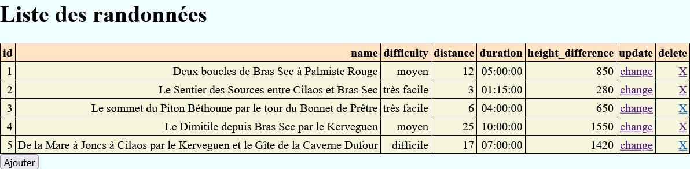

# Requirements
- PHP 8.0+ and server ([XAMPP](https://www.apachefriends.org/fr/index.html) prefered)
- MySQL (included in XAMPP)
- A database called "becode" containing a table named "hiking" (check [hiking](hiking.sql) for details)
- This repo ;)

# Launch
Open XAMPP then start both Apache and MySQL servers. Go to the root of this repository, open your terminal and use :
```sh
php -S localhost:PORT
```
PORT can be any valid 4 digits number like `5000`.

**!! Warning : if you're working with a different terminal than the one provided by XAMPP, you may need to add xampp/php path to your environment variables.**

# API
- **/read.php** is the main page where you can see the data
- **/create.php** is where you can create a new hike
- **/update.php?id={}** is where you can update the infos of a hike
- **/delete.php?id={}** is where you delete a hike

All these endpoints have buttons to access each others.

**!! Warning : the starting point of the server (/) is empty. You have to navigate to one of these endpoints manually (read prefered)**

# Use
Here is what you should see when your navigate to /read.php :



Otherwise, you should see an error message.

**!! Warning : the following website is written in French.**
